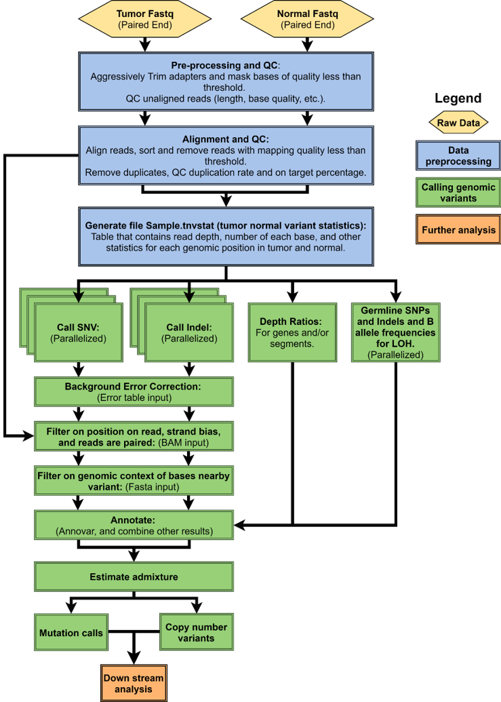
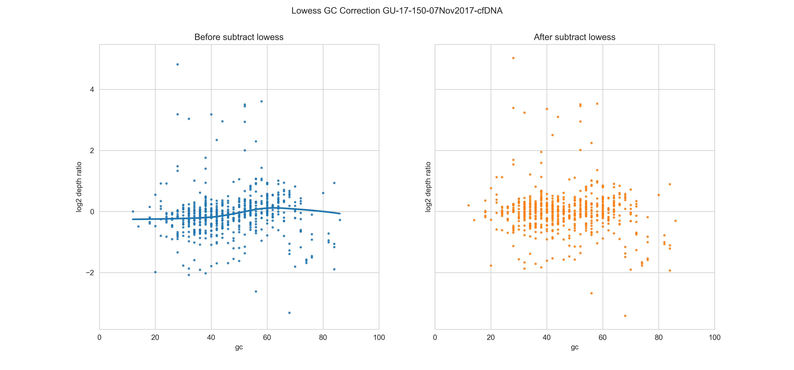
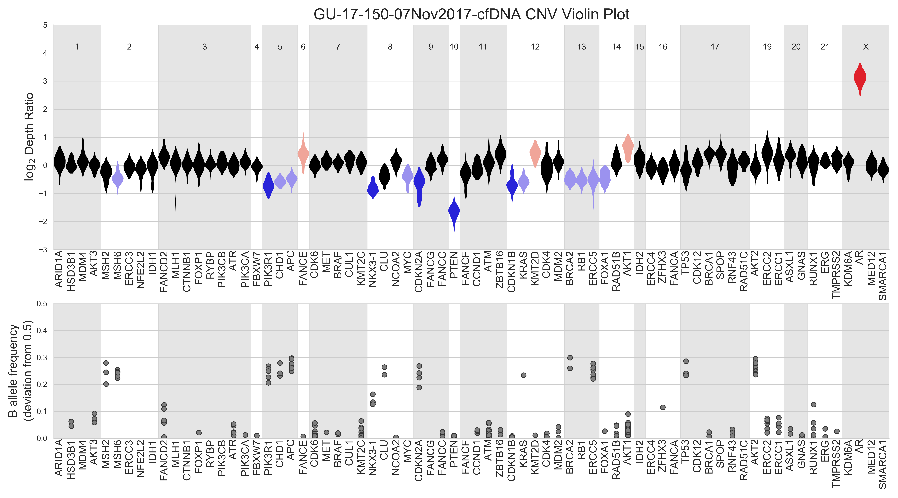

# CTDNA PROSTATE PANEL PIPELINE README

## Introduction
This repo is a slurm ctdna variant calling pipeline as part of a DAP-Certified clinical assay available to canadian patients to detect DNA repair mutations and enable access to PARP inhibitors.

It depends on several tools and environments. Each must be defined in the config.txt file. The config.txt file is sourced in all of the bash scripts for the variables associated with paths to files, binaries and environments.
The three environments that this pipeline depends on by default are "conda_pysam_env" which includes python 3.7 and pysam, "pysamstats_env" which includes pysamstats (https://github.com/alimanfoo/pysamstats) and python 3.6 (these envs could not be concatenated into a single env as they do have conflicts). The rust environment only includes rust and the trimming and masking. If these tools are replaced, or you have a compiled binary, then the rust env can be removed. 

## PIPELINE STEPS
The pipeline is composed of two distinct stages: 

First the generation of a "tnvstat file". This file is pileup-like, each row is a genomic loci and columns are base level statistics. The name is derived from "tumor-normal variant statistics" and it is pronounced "Tee-eN-Vee-stat" and it has the suffixc ".tnvstat". 

The tnvstat file is the input for the subsequent SNV, InDel and Copy number calling analyses.



The entire pipeline can be run through the script `scripts/gene_panel_slurm_pipeline.bash` This is a detailed accounting of the steps in this pipeline:

1) Primary processing:
Tumor and normal fastqs are trimmed, masked and aligned with BWA-mem. Duplicates are removed and read groups are added with Picard. This is all accomplished with the script `trim_align_removeduplicates.bash`. For consistency with other Wyatt lab pipelines we are using the fasta rust package for trimming and masking, but trimming can also be done with any other tool that uses a "trim by quality" algorithm such as this [trimming tool](https://resources.qiagenbioinformatics.com/manuals/clcassemblycell/current/index.php?manual=Quality_trimming.html) to get similar results.
For masking, all bases with a base quality score <20 (by default) are replaced with N and not used for further variant calls.
`trim_align_removeduplicates.bash` takes as input `/path/to/read1.fq.gz`, `/path/to/read2.fq.gz` the basename of the sample (tumor name or normal name) an outputdir and the config.txt. Note tumor and normal samples cannot have the same name. The output of this step is the processes tumor and normal bam files and the file *.dup_metrics which is the duplication metrics from picard mark duplicates.

2) Making a tnvstat file:
We make a pileup file which contain statistics of base distributions at each genomic loci. This is done with the script `scripts/make_tnvstat_file.bash`. The inputs are the tumor and normal bam files and other supplemental files including a gc content file produced using Sequenza and a bed file donating the gene annotations from whatever panel is being used. These 2 files are located by default in `supp_files` but can be changed in the config file under the variables `targetbed` and `gcbed`

3) Copynumber calling:
Copynumber calling is accomplished using the python script `gene_panel_copynumber.py`. It produces 2 plots plots and 2 tsvs.

- The file `${tumor_sample}_gc_correction.png` explains the distribution of gc% to log depth ratio before and after lowess correction.



- The file `${tumor_sample}_CN_violinplot.pdf` is a violin plot of the depth ratio distribution of each gene. This plot is extremely important for determining whether a gene is amplified or deleted.



- The file `${tumor_sample}.cn` contains the mean normalized Log2 depth ratio of each gene in the sample under the column header mean.gene.ndr. This is the mean of each violin in the above plot. The file includes: 
    | gene | mean.gene.ndr | sample |
    |------|---------------|--------|
    |ARID1A|-0.0040|sample_name |
    |HSD3B1| 0.0925|sample_name |
    |MDM4  | 0.2836|sample_name |

- The file `${tumor_sample}_b_allele_table.tsv` contains each B-allele frequency and associated information with that loci to help interpret this data. A "B-allele" refers to the base with fewer supporting reads at a heterozygous loci in the normal sample. The B-allele frequency is the frequency of that base in the paired tumor sample. In the tumor sample deviation from a frequency of 0.5 indicates a loss of heterozygosity or other non diploid copy states. The file `${tumor_sample}_b_allele_table.tsv` contains the following columns.
    |column|explanation|
    |------|-----------|
    |chrom |chromosome|
    |pos   |position|
    |ref   |referense base|
    |Log2.depth.ratio|log depth ratio of snp|
    |n_zygosity | zygosity in normal sample (heterozygous)|
    |Major_freq_n | frequency of majority base in normal sample|
    |Minor_freq_n | 1 - Major_freq_n|
    |Minor_Allele | minority base in normal sample|
    |Major_Allele | majority base in normal sample|
    |B_allele_freq | minor allele frequency in tumor sample|
    |gene | gene containing snp in row|


4) Somatic variant calling:
A subdirectory called "variant_intermediate_files" is created in the output directory. first `scripts/call_snv.py` and `scripts/call_indel.py` call variants based on read support and several other factors. The raw variants are then annotated and saved as `${tumor_sample}_somatic_anno_snv.tsv`. Then a filter for exac values and measures of low complexity in surrounding bases is applied making the file `${tumor_sample}_snv_lcf.tsv`. Then a filter to determine if the variant was primarily found only in the ends of the reads is applied to produce `${tumor_sample}_snv_lcf_re.tsv`. If you need cosmic values, any score or any annotation including the values in the tnvstat, they are all in `${tumor_sample}_snv_lcf_re.tsv`.
A similar process occurs with the indels with the exception of the read end filter. 
<!-- Then the indels and snvs are concatenated and reformatted into a `"${tumor_sample}.maf"` file compatible with https://www.bioconductor.org/packages/devel/bioc/vignettes/maftools/inst/doc/maftools.html. The maf file is moved to the primary output directory. -->
The variant_intermediate_files is kept so as to allow for further examination of filtered or raw variants.

5) Germline variant calling:
Any germline variant caller will do. Originally I wrote my own but in the current version we are using vardict-java and the variants are annotated with annovar. A subdirectory called "vardict" contains intermediate files. I also do tumor-normal somatic variant calling with vardict which stays in that subdirectory and can be used for comparison to the CircuiTT output. The germline variant calls after filtering are moved to the main output directory and are called `${normal_sample}_germline.tsv`.

## INSTALLATION and EXECUTION
Download the repo.
there are two environment files "pysam_env" and "pysamstats_env". 
these environments need to be created. Then supplemental files too large for github will need to be downloaded to the appropriate paths.
```bash
git clone https://github.com/elieritch/CircuiTT.git;
conda create -n <NAME> --file pysam_env
conda create -n <NAME> --file pysamstats_env
bash /path/to/CircuiTT/install.bash
```

then put the names you have chosen into the appropriate values in the config.txt

The conda command  will also need to be available within subshells that dont necessarily have users environment variables (ie within parallel), this is why the conda profile profile.d/conda.sh needs to be sourced as well. This script comes with every installation of conda and just exports the conda variables and appends them to the $PATH.

This entire pipeline can be run from the submission node of your cluster using the commands:
```bash
script="/PATH/TO/gene_panel_slurm_pipeline.bash";
outputdir="/PATH/TO/DIRECTORY/${name_tumor}";
mkdir -p "/PATH/TO/DIRECTORY/${name_tumor}";
read1_t="/PATH/TO/${name_tumor}_READ_1.fq.gz";
read2_t="/PATH/TO/${name_tumor}_READ_2.fq.gz";
read1_n="/PATH/TO/${name_normal}_READ_1.fq.gz";
read2_n="/PATH/TO/${name_normal}_READ_2.fq.gz";
name_tumor="${name_tumor}";
name_normal="${name_normal}";
configfile="/PATH/TO/config.txt";
sbatch ${script} ${read1_t} ${read2_t} ${read1_n} ${read2_n} ${name_tumor} ${name_normal} ${outputdir} ${configfile};
```
Most often another script is used to create the above code for a given cohort into a file called launch.bash and the that file is executed to submit each slurm job. 

The paths to each of the other things in the config.txt also have to be filled out.
